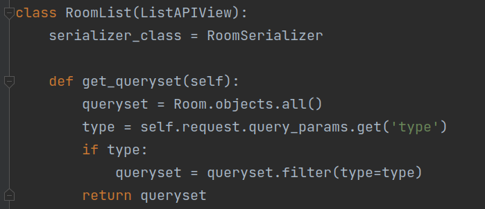
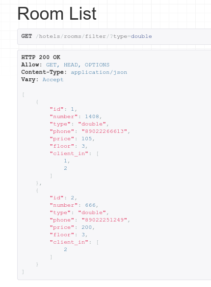
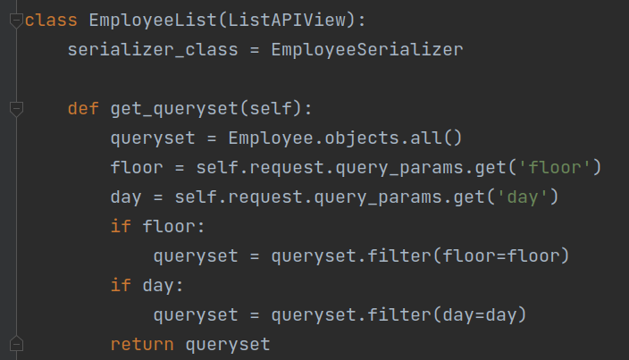
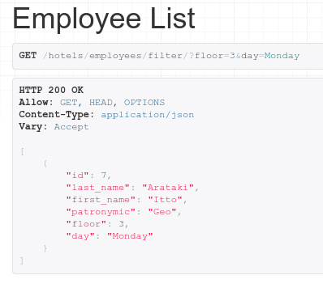
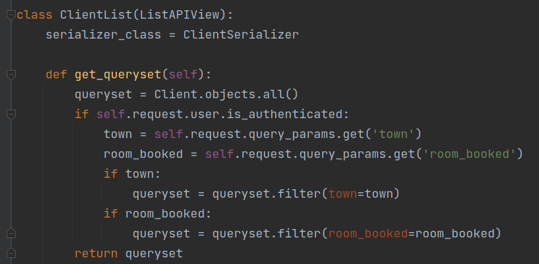
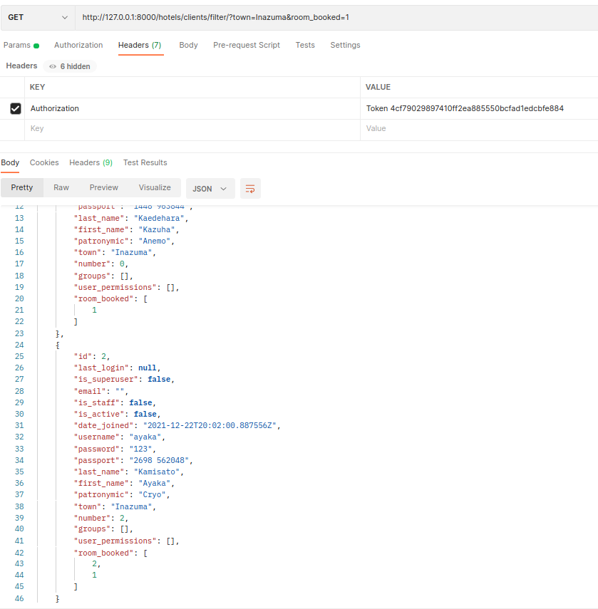

# Ручные фильтры

## Фильтрация комнат отеля по типу
Принимается параметр из url-адреса, выводятся отфильтрованные данные. (GET, ListAPIView)
### views.py

### Результат

## Фильтрация сотрудников по дню и этажу уборки
Принимаются 2 параметра из url-адреса, выводятся отфильтрованные данные. (GET, ListAPIView)
### views.py

### Результат

## Фильтрация гостей по родному городу и забронированной комнате
Принимаются 2 параметра из url-адреса, если пользователь авторизован, то выводятся отфильтрованные данные, а если нет — 
неотфильтрованные. (GET, ListAPIView)
### views.py

### Результат

