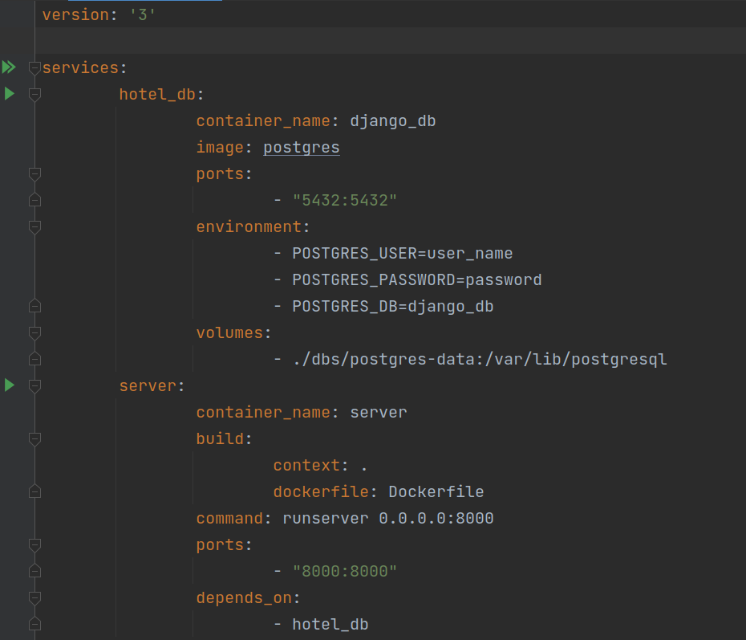
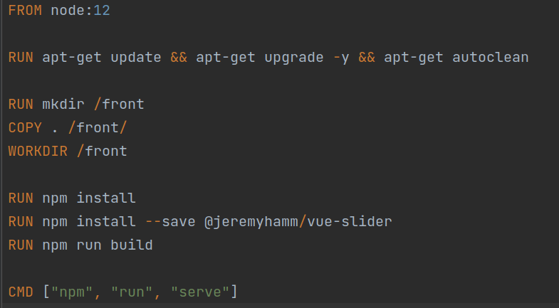
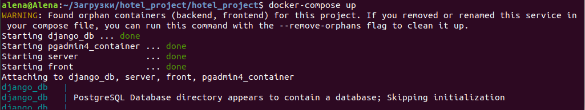
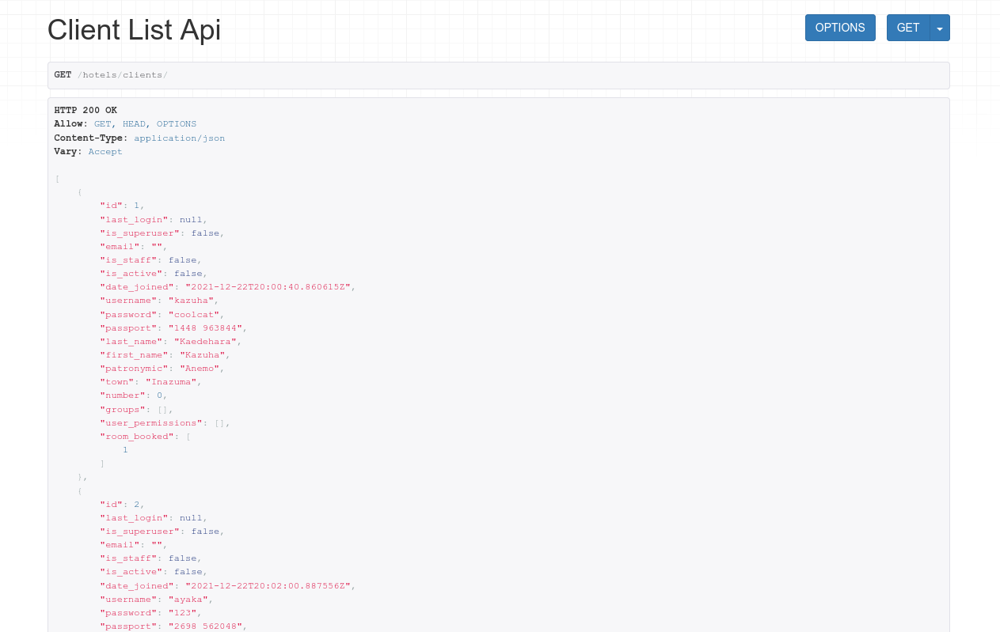
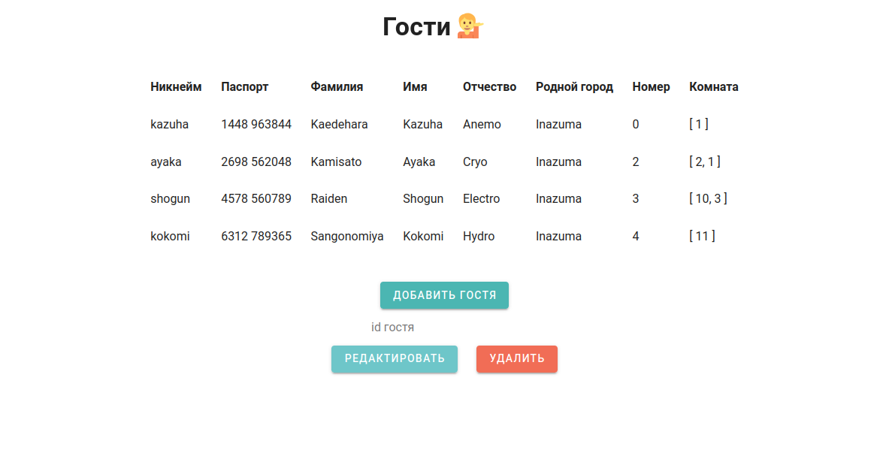
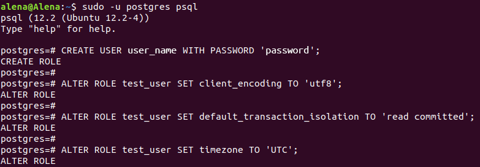
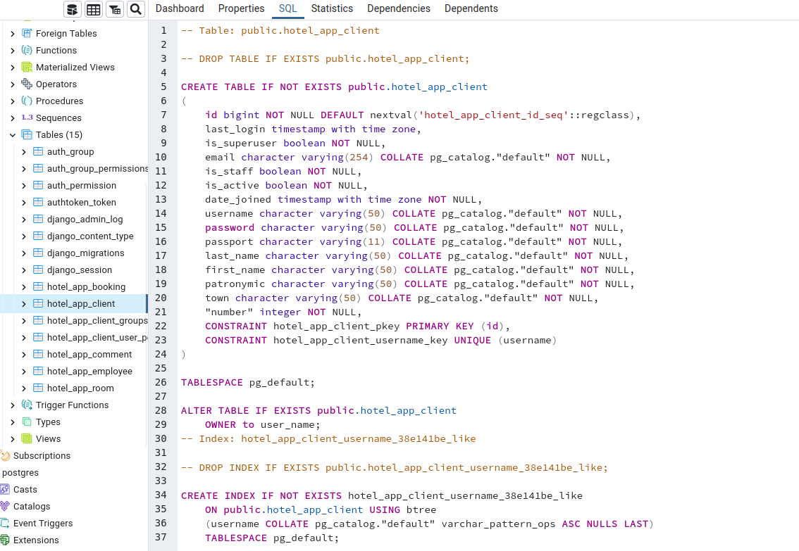
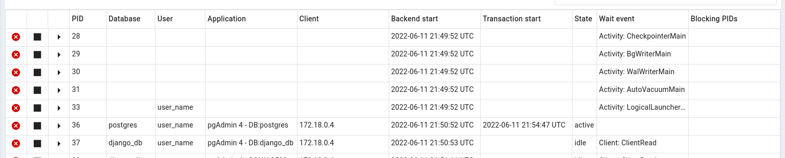

# Оркестрация средствами Docker-compose

## docker-compose.yml

## Dockerfile для запуска клиентской части проекта

## Запуск

## Серверная часть

## Клиентская часть

## Добавление нового пользователя через терминал

## pgAdmin

## Подключение созданного пользователя

